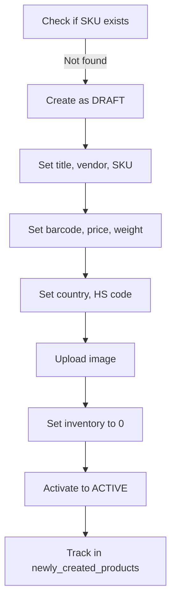
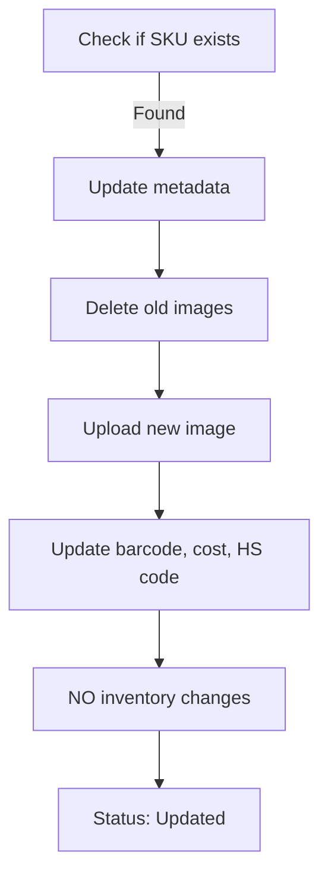

# Product Creation Feature - Implementation Guide

## Overview

The Shopify scraper now supports **automatic product creation** with strict inventory safety controls. Products that don't exist in Shopify will be created with all metadata, then activated only after validation.

### Key Safety Principle

**Session-scoped tracking**: A `newly_created_products` set tracks product IDs created in the current job. Inventory operations are ONLY allowed if `product_id in newly_created_products`.

---

## Features

### 1. Automatic Product Creation

- **When**: Products with SKUs that don't exist in Shopify
- **How**: Created as DRAFT → Populate all fields → Set inventory → Activate to ACTIVE
- **Default Inventory**: 0 units at default location

### 2. Safe Inventory Management

- ✅ Inventory ONLY set for newly created products
- ❌ NEVER modify inventory on existing products
- 🔒 Multi-layer safety checks

### 3. Separate Status Tracking

| Status | Meaning |
|--------|---------|
| `Created` | New product successfully created |
| `Updated` | Existing product updated (NO inventory changes) |
| `New Product - Not Found` | Would create but no scraper data available |
| `Not Found` | Existing product, no scraper data available |
| `Error` | Operation failed |

---

## Database Schema

### New Columns in `job_results`

```sql
product_created BOOLEAN DEFAULT 0      -- TRUE only when created in this job
product_id TEXT                        -- Shopify product GID
variant_id TEXT                        -- Shopify variant GID
inventory_set BOOLEAN DEFAULT 0        -- TRUE only when inventory was set
inventory_quantity INTEGER DEFAULT 0   -- Quantity that was set
```

### New Columns in `jobs`

```sql
created_count INTEGER DEFAULT 0        -- Number of products created
updated_count INTEGER DEFAULT 0        -- Number of products updated
inventory_set_count INTEGER DEFAULT 0  -- Number of inventory operations
```

---

## Safety Mechanisms

### Layer 1: Session-Scoped Tracking
```python
newly_created_products = set()  # Only products created in THIS job
```

### Layer 2: Explicit Check Before Inventory
```python
if product_id in newly_created_products:
    # Safe to set inventory
    shopify.set_inventory_level(...)
```

### Layer 3: Database Audit Trail
- `product_created` = TRUE only when product was created
- `inventory_set` = TRUE only when inventory was modified

### Layer 4: Draft-First Approach
1. Create product as DRAFT
2. Upload image and metadata
3. Set inventory (0 units)
4. Activate to ACTIVE

### Layer 5: Status Differentiation
- Clear distinction between created/updated products
- Separate logging for new vs existing products without data

---

## Safety Audit

### Critical Safety Check

Run this query after processing jobs. It should **ALWAYS return ZERO rows**:

```sql
SELECT * FROM job_results
WHERE inventory_set = 1 AND product_created = 0;
```

If this returns any rows, it means inventory was set on an existing product (**CRITICAL BUG**).

### Using the Audit Script

```bash
sqlite3 data/scraper.db < safety_audit.sql
```

This will show:
- Critical safety violations (should be 0)
- Product creation vs update summary
- Inventory operations summary
- Recent job statistics

---

## Usage

### 1. Prepare CSV

Your CSV must contain these columns:
- `Handle`: Product handle (or identifier)
- `SKU`: Stock Keeping Unit
- `Vendor`: Vendor name (e.g., "Pentart", "Aistcraft")

Example:
```csv
Handle,SKU,Vendor
product-001,ABC123,Pentart
product-002,XYZ789,Aistcraft
```

### 2. Upload via Flask App

1. Navigate to the app: `http://localhost:5000`
2. Authenticate with your Shopify store
3. Upload CSV file
4. Monitor job progress

### 3. Check Results

**Web Interface:**
- View job details at `/job/{job_id}`
- See created vs updated counts
- Review errors and warnings

**Database Query:**
```sql
SELECT * FROM jobs WHERE id = <job_id>;
SELECT * FROM job_results WHERE job_id = <job_id>;
```

---

## Product Creation Process

### For New Products



### For Existing Products



---

## Error Handling

### Scenario 1: Product Creation Fails
- **Result**: No product in Shopify
- **Database**: `status = "Error"`, `product_created = FALSE`
- **Action**: Safe to retry

### Scenario 2: Product Created, Image Upload Fails
- **Result**: Product exists (DRAFT)
- **Database**: `product_created = TRUE`, error message logged
- **Action**: Re-run or manually upload image

### Scenario 3: Product Created, Inventory Fails
- **Result**: Product exists with all metadata
- **Database**: `inventory_set = FALSE`
- **Action**: Set inventory manually (safe - product was just created)

### Scenario 4: Product Created, Activation Fails
- **Result**: Product remains DRAFT
- **Action**: Activate manually in Shopify admin

---

## API Methods

### ShopifyClient.create_product()

```python
product_id, variant_id, inventory_item_id = shopify.create_product(
    title="Product Name",
    vendor="Vendor Name",
    sku="SKU123",
    barcode="EAN123456789",
    price=19.99,
    weight=500,  # grams
    country="SI",  # 2-letter code
    hs_code="4823.90",
    category="Art Supplies"
)
```

### ShopifyClient.get_default_location()

```python
location_id = shopify.get_default_location()
# Returns: "gid://shopify/Location/123456789"
```

### ShopifyClient.set_inventory_level()

```python
# CRITICAL: Only call for newly created products!
success = shopify.set_inventory_level(
    inventory_item_id="gid://shopify/InventoryItem/123",
    location_id="gid://shopify/Location/456",
    quantity=0
)
```

### ShopifyClient.activate_product()

```python
success = shopify.activate_product(product_id)
```

---

## Testing Checklist

### Test 1: Create New Products
- [ ] Prepare CSV with 3 SKUs that DON'T exist in Shopify
- [ ] Upload CSV
- [ ] Verify products created as ACTIVE
- [ ] Verify images uploaded
- [ ] Verify metadata set (barcode, weight, cost, country, HS code)
- [ ] Verify inventory = 0 units
- [ ] Verify database: `product_created = 1`, `status = "Created"`

### Test 2: Update Existing Products
- [ ] Prepare CSV with 3 SKUs that DO exist in Shopify
- [ ] Upload CSV
- [ ] Verify products updated (images, metadata)
- [ ] Verify inventory levels UNCHANGED
- [ ] Verify database: `product_created = 0`, `status = "Updated"`

### Test 3: Mixed Batch
- [ ] CSV with 5 new + 5 existing products
- [ ] Verify correct branching
- [ ] Run safety audit (should return 0 rows)

### Test 4: Missing Data
- [ ] CSV with SKU but no scraper data
- [ ] Verify `status = "New Product - Not Found"` for new products
- [ ] Verify `status = "Not Found"` for existing products

---

## Rollback Strategy

If something goes wrong:

### Step 1: Identify Affected Products
```sql
SELECT product_id FROM job_results
WHERE job_id = <job_id> AND product_created = 1;
```

### Step 2: Delete via GraphQL
```graphql
mutation deleteProduct($id: ID!) {
  productDelete(input: {id: $id}) {
    deletedProductId
    userErrors { field message }
  }
}
```

### Step 3: Mark Job as Rolled Back
```sql
UPDATE jobs SET status = 'rolled_back' WHERE id = <job_id>;
```

---

## Monitoring

### Key Metrics to Watch

1. **Created vs Updated Ratio**
   ```sql
   SELECT created_count, updated_count FROM jobs WHERE id = <job_id>;
   ```

2. **Inventory Operations**
   ```sql
   SELECT COUNT(*) FROM job_results WHERE inventory_set = 1;
   ```

3. **Error Rate**
   ```sql
   SELECT status, COUNT(*) FROM job_results GROUP BY status;
   ```

### Alerts to Set Up

- Alert if safety audit query returns > 0 rows
- Alert if `inventory_set_count != created_count`
- Alert if error rate > 10%

---

## Permissions

Current API scopes (already sufficient):
```
read_products,write_products,read_inventory,write_inventory
```

**Note**: `write_products` includes `productCreate` and `productUpdate`

---

## Success Criteria

- ✅ Products created via CSV upload
- ✅ Inventory ONLY set for newly created products
- ✅ Existing products updated without inventory changes
- ✅ Products created as DRAFT, activated after data population
- ✅ Separate logging for "New Product - Not Found"
- ✅ All metadata set correctly
- ✅ Images uploaded and named
- ✅ Database audit trail complete
- ✅ Safety audit query returns 0 rows

---

## Support

If you encounter issues:

1. Check the safety audit queries
2. Review job results in database
3. Verify Shopify API scopes
4. Check logs for detailed error messages
5. Run test batch with known products first

---

## Version History

### v1.0.0 (2026-01-30)
- Initial implementation
- Session-scoped inventory safety
- Draft-first product creation
- Separate status tracking for new vs existing products
- Multi-layer safety mechanisms
